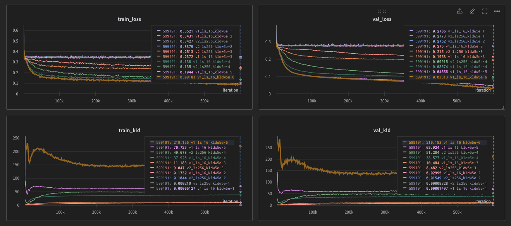

# ConvVAE MNIST Experiment

Link: https://wandb.ai/zzznorlax/CONVVAE?workspace=user-zzznorlax

### Settings:

---
- Use KLD Weight from 5e-1 ~ 5e-6
- ConvVAE with 3 layers of conv2d

### Results:

---

- Loss gets to drop when kld weight is smaller than 5e-2
  


- The results of latent interpolation
  


- Using a greater latent_size = 256 does not make the latent distribution more separated than latent_size = 16
  

- KLD Weight = 5e-3 has the most diversity while keeping the reconstruction quality
  


- Reconstruction result of each KLD weight, there are no visible differences when KLD weights < 5e-3
  


### Model Structure:
---

```python
class Encoder(nn.Module):
    def __init__(self, in_ch: int = 3, d_size: int = 32, latent_dim: int = 256, input_size: int = 28):
        super(Encoder, self).__init__()

        self.d_size = d_size

        self.conv_layers = nn.Sequential(
            nn.Conv2d(in_ch, d_size * 2**0, kernel_size=3, stride=2, padding=1),
            nn.ReLU(),
            nn.Conv2d(d_size, d_size * 2**1, kernel_size=3, stride=2, padding=1),
            nn.ReLU(),
            nn.Conv2d(d_size * 2**1, d_size * 2**2, kernel_size=3, stride=2, padding=1),
            nn.ReLU(),
        )

        self.fc1 = nn.Linear(d_size * 2**2 * 4 * 4, 256)

        self.fc_mu = nn.Linear(256, latent_dim)
        self.fc_logvar = nn.Linear(256, latent_dim)

    def forward(self, x):
        x = self.conv_layers(x)

        x = x.view(-1, self.d_size * 2**2 * 4 * 4)

        x = F.relu(self.fc1(x))
        mu = self.fc_mu(x)
        logvar = self.fc_logvar(x)
        return mu, logvar

class Decoder(nn.Module):
    def __init__(self, latent_dim: int = 256, d_size: int = 32):
        super(Decoder, self).__init__()

        self.d_size = d_size

        self.fc1 = nn.Linear(latent_dim, 256)
        self.fc2 = nn.Linear(256, d_size * 2**2 * 4 * 4)

        self.deconv_layers = nn.Sequential(
            nn.ConvTranspose2d(d_size * 2**2, d_size * 2**1, kernel_size=3, stride=2, padding=1, output_padding=1),
            nn.ReLU(),
            nn.ConvTranspose2d(d_size * 2**1, d_size * 2**0, kernel_size=3, stride=2, padding=1, output_padding=1),
            nn.ReLU(),
            nn.ConvTranspose2d(d_size * 2**0, 1, kernel_size=3, stride=2, padding=1, output_padding=1),
            nn.Sigmoid(),  # input image is normalized to [0, 1], so the output of the decoder should also be normalized to [0, 1].
        )

    def forward(self, z: torch.Tensor):
        x = F.relu(self.fc1(z))
        x = F.relu(self.fc2(x))

        x = x.view(-1, self.d_size * 2**2, 4, 4)

        x = self.deconv_layers(x)
        return x

class ConvVAE(nn.Module):
    def __init__(self, in_ch: int = 3, d_size: int = 32, latent_dim: int = 256, input_size: int = 28):
        super(ConvVAE, self).__init__()
        self.encoder = Encoder(in_ch, d_size, latent_dim, input_size)
        self.decoder = Decoder(latent_dim, d_size)

        self.latent_dim = latent_dim

    def reparameterize(self, mu: torch.Tensor, logvar: torch.Tensor):
        std = torch.exp(0.5 * logvar)
        eps = torch.randn_like(std)
        z = mu + eps * std
        return z

    def forward(self, x: torch.Tensor):
        mu, logvar = self.encoder(x)
        z = self.reparameterize(mu, logvar)
        recon_x = self.decoder(z)
        return recon_x, mu, logvar

    def sample_z(self, mu: torch.Tensor, logvar: torch.Tensor, eps: Optional[torch.Tensor] = None):
        std = torch.exp(0.5 * logvar)

        if eps is None:
            eps = torch.randn_like(std)

        z = mu + eps * std
        return z
```

### Hyperparameters:

---

```bash
# Hyperparameters
EPOCHS = 10  # 30 was used in paper
BATCH_SIZE = 16  # 4 to 16 depends on resolution

# Learning rate
LR = 1e-4  # 1e-4 from paper

# File path
DATASET_PATH = "dataset/mnist_png/training"
VALIDATION_DATASET_PATH = "dataset/mnist_png/testing"
OUTPUT_PATH = "datasets/outputs"
EXT = ".png"

# Checkpoint related
CKPT_INTERVAL = 1000  # in batch
CKPT_DIR = "ckpt"
CKPT_LABEL = "v1_ls_16_kldw5e-6"
RESUME = 0

# Logging Related
LOGGER_LEVEL = 0
LOG_INTERVAL = 100  # in batch

# WANDB_MODE = "offline"
WANDB_MODE = "online"

# Training Params
IMG_SIZE = 32

D_SIZE = 32
LATENT_SIZE = 16

AUG_ROTATION = 45
AUG_AUTO_CONTRAST = 0.5
AUG_COLOR_JITTER_BRIGHTNESS = 0.5

# Metric Params
KLD_WEIGHT = 5e-6

# Sample Params
SAMPLE_GRID_SIZE = 8
SAMPLE_LATENT_NUM = 10000

SAMPLE_EPS_IMG_NUM = 1

# Project related
# PROJECT_NAME = "CONVVAE-TEST"
PROJECT_NAME = "CONVVAE"

DATASET_SIZE = -1
```
